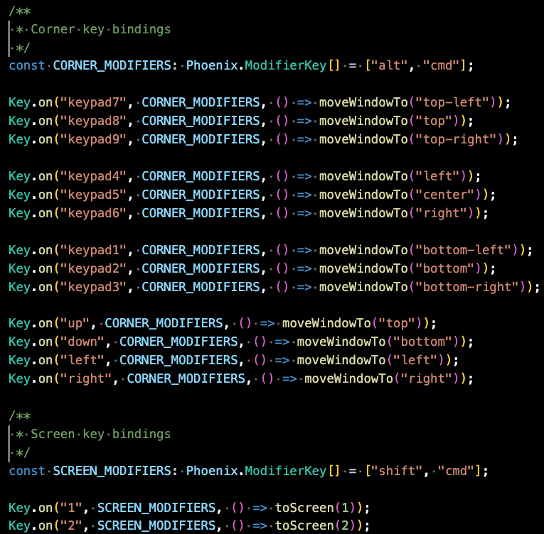

# Renan Config Phoenix

Configuration for PhoenixJs Window Manager - https://github.com/kasper/phoenix/

## Shortcuts



## Installation

1. Be sure to exit PhoenixJs.
2. Be sure to not have any other running configuration as mentioned [here](https://kasper.github.io/phoenix/#javascript-api).
3. Run the following command in your terminal.

```sh
git clone git@github.com:renanborgez/renan-config-phoenix.git ~/.config/phoenix/
```

4. Start Phoenix again.
5. Done!

You should already be able to use this config, test it by pressing `Alt` + `Cmd` + `LeftArrow` your
window should move to the left side and occupy 50% of the screen.

## Extending this configuration

This configuration uses Typescript and NodeJs 20+.

If you open ~/.config/phoenix/ you will see a full typescript project.

You can use the following commands inside the configuration project:

```sh
$ npm install # it will install all dependencies
$ npm run build # will build the typescript files and should immediately work
$ npm run dev # will start watch server and propagate any changes to phoenix immediately as well
```
